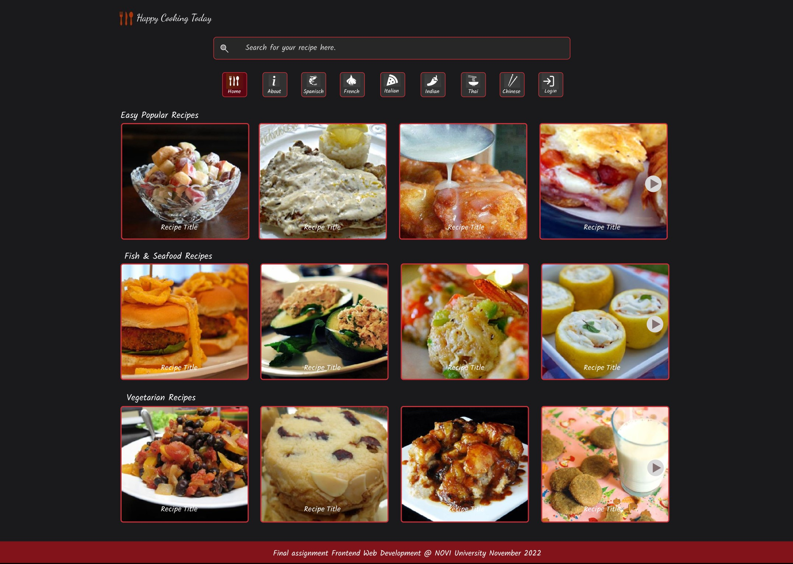

# HAPPY COOKING TODAY

## Table of contents

1. Introduction.
2. Screenshot from Homepage of this application.
3. Installation and Requirements.
4. Register and Login.
5. Getting Started with Create React App.

## 1. Introduction

In addition to 3 proposed themes with recipes, this Application also presents foreign cuisines with their specific
recipes. You can search for a meal on your own dish or on ingredients. By clicking on an image of the recipe, further
information such as the preparation method and the required ingredients will be shown. There is a short guide on the
About page. You can register and then sign in to view your personal Profile page.

## 2. Screenshot from Homepage of this application.

## 3. Installation and Requirements.

### Step 1: Installing an IDE (Integrated Development Environment)

In order to open, use or modify this application, you must have an IDE installed on your computer. The application is
built with the WebStorm IDE, but feel free to use a comparable IDE of your choice.

### Step 2: Installing Node.js and npm.

Before you start, you will need to have Node.js and npm installed on your system.
Check [this](https://nodejs.org/en/download/) website to download and install the latest version. This project is set up
with Node.js Version 17.3.0 and npm Version 8.5.2. Check if Node.js and npm are installed on your system and with what
version, by running the following commands on the command line:

`node -v`

`npm -v`

### Step 3: Installing dependencies.

All the dependencies are mentioned in the package.json file. Install them all at once by running the following command
on the command line:

`npm install`

### Step 4: API's used from Spoonacular & Novi Backend.

1. For make this App used a recipe API from [Spoonacular](https://spoonacular.com/food-api/docs)
2. Used for authentication pages an API from
   the [NOVI Backend](https://github.com/hogeschoolnovi/novi-educational-backend-documentation/blob/main/README.md#0-Beschrijving)

### Step 5: API's Key used from Spoonacular.

This app has pre-installed an API KEY in the .env file and placed in the root of the directory. The API KEY is
temporarily pre-installed and will no longer work within a few weeks after my study.

### This is very important! otherwise you can't run this App.

But the best is to create your own free account with [Spoonacular](https://spoonacular.com/food-api/console#Dashboard)
and then enter it in the .env file with the following line:

### REACT_APP_API_KEY=YouAPIKey

### Step 6: Running and testing the project locally.

To run the project locally and test all the functions, run the following command on the command line:

`npm start`

### 4. Register and Login.

It is possible to register for an account to see your personal profile page. Just press Login navigation button and
follow the instructions. When your start this application there will be not registered. For tryout purposes you can
use the following data on the register page. 

Fill in the register form fields:

* email: `pizza@italian.com` 
* username: `ilikepizza`
* password: `seafood`
* role: `user` or `admin`

After successful registration you'll be forwarded to a Login page. Enter your username and password and click the on the Login button.
You'll be brought to your private profile page. On the profile page click Logout en you wil come on the Homepage.

---

## 5. Getting Started with Create React App

This project was bootstrapped with [Create React App](https://github.com/facebook/create-react-app).

## Available Scripts

In the project directory, you can run:

### `npm start`

Runs the app in the development mode.\
Open [http://localhost:3000](http://localhost:3000) to view it in your browser.

The page will reload when you make changes.\
You may also see any lint errors in the console.

### `npm test`

Launches the test runner in the interactive watch mode.\
See the section about [running tests](https://facebook.github.io/create-react-app/docs/running-tests) for more
information.

### `npm run build`

Builds the app for production to the `build` folder.\
It correctly bundles React in production mode and optimizes the build for the best performance.

The build is minified and the filenames include the hashes.\
Your app is ready to be deployed!

See the section about [deployment](https://facebook.github.io/create-react-app/docs/deployment) for more information.

### `npm run eject`

**Note: this is a one-way operation. Once you `eject`, you can't go back!**

If you aren't satisfied with the build tool and configuration choices, you can `eject` at any time. This command will
remove the single build dependency from your project.

Instead, it will copy all the configuration files and the transitive dependencies (webpack, Babel, ESLint, etc) right
into your project so you have full control over them. All of the commands except `eject` will still work, but they will
point to the copied scripts so you can tweak them. At this point you're on your own.

You don't have to ever use `eject`. The curated feature set is suitable for small and middle deployments, and you
shouldn't feel obligated to use this feature. However we understand that this tool wouldn't be useful if you couldn't
customize it when you are ready for it.

## Learn More

You can learn more in
the [Create React App documentation](https://facebook.github.io/create-react-app/docs/getting-started).

To learn React, check out the [React documentation](https://reactjs.org/).

### Code Splitting

This section has moved
here: [https://facebook.github.io/create-react-app/docs/code-splitting](https://facebook.github.io/create-react-app/docs/code-splitting)

### Analyzing the Bundle Size

This section has moved
here: [https://facebook.github.io/create-react-app/docs/analyzing-the-bundle-size](https://facebook.github.io/create-react-app/docs/analyzing-the-bundle-size)

### Making a Progressive Web App

This section has moved
here: [https://facebook.github.io/create-react-app/docs/making-a-progressive-web-app](https://facebook.github.io/create-react-app/docs/making-a-progressive-web-app)

### Advanced Configuration

This section has moved
here: [https://facebook.github.io/create-react-app/docs/advanced-configuration](https://facebook.github.io/create-react-app/docs/advanced-configuration)

### Deployment

This section has moved
here: [https://facebook.github.io/create-react-app/docs/deployment](https://facebook.github.io/create-react-app/docs/deployment)

### `npm run build` fails to minify

This section has moved
here: [https://facebook.github.io/create-react-app/docs/troubleshooting#npm-run-build-fails-to-minify](https://facebook.github.io/create-react-app/docs/troubleshooting#npm-run-build-fails-to-minify)

